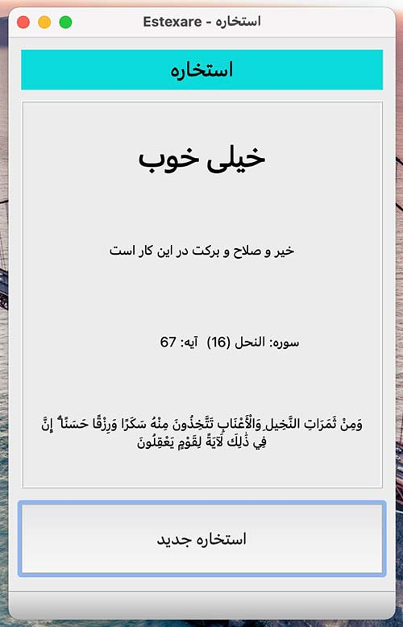

# Estexare_PyQt

Estexare GUI app using Python and PySide (PyQt)  

Screenshot:  
   


  
---  
  

## Requirements
Needs `PySide6` to run, download from:  
[PySide6](https://pypi.org/project/PySide6/#files)  
Or install it using pip:  
```bash
pip install PySide6  
```  

  
---  


## Make a stand-alone executable
If you want make a single executable file (like the releases):  

```bash

# install the pyinstaller  
pip install PyInstaller  

# make the executable  
pyinstaller -F ./main.py  
```


